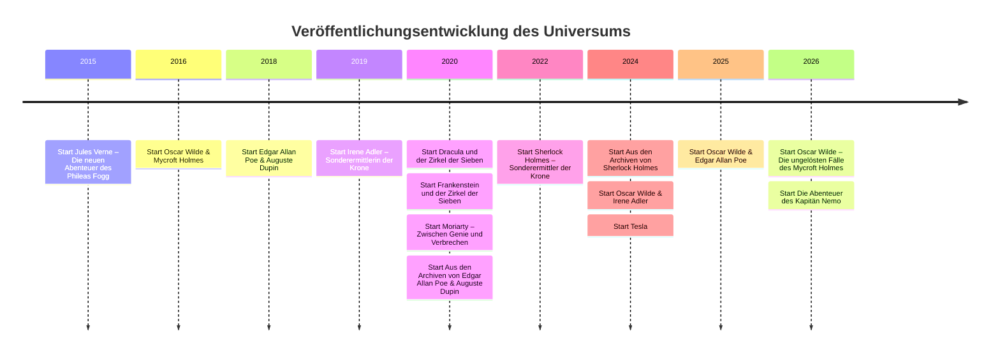

# Sonderermittler der Krone und das Spin-off-Universum

## Kurzfazit

Die titelgebende Webpräsenz **sonderermittler-der-krone.de** fungiert als die derzeit nützlichste Primärreferenz für die Reihenstruktur, die Kanonzuordnung, die Episodenreihenfolge, die Episoden-URLs, die Cover-Systematik sowie knappe Inhalts- und Figurenangaben. Sie wird laut Impressum von **Tim Gerundt** betrieben und ist damit keine offensichtliche Publisher- oder Label-Seite; für belastbare Handelsmetadaten wie exakte Erscheinungsdaten, Formate, EAN/ISBN/ISBN-13, Preis- und Streamingstatus mussten daher zusätzlich Händler- und Katalogquellen herangezogen werden. Genau diese Rollenverteilung ist für diese Recherche zentral: **Kanon und Ordnung** stammen primär von der titelgebenden Webpräsenz, **Verkaufs- und Handelsmetadaten** vor allem von HolyShop, Thalia, Audible, Kassettenkiste und weiteren Händler-/Bibliotheksquellen. citeturn1view0turn23view0turn29view0turn34search2turn45search5

Im **offiziell auf der Referenzseite gelisteten Korpus** ergeben sich **305 Episoden** in **15 Serienlinien**. Diese 15 Linien umfassen Kernreihen, Charakter-Spin-offs, Antagonistenreihen, zwei „Aus den Archiven“-Re-Brandings älterer Stoffe und die 2024 bis 2026 hinzugekommenen Blitz-Verlag-Mini- bzw. Neureihen. Gleichzeitig zeigen Händlerquellen bereits **zusätzliche geplante oder weiterlaufende Titel**, die auf der Referenzseite noch nicht oder noch nicht vollständig gespiegelt sind; der Korpus ist also **kanonisch indexiert, aber publizistisch in Bewegung**. citeturn2view0turn4view0turn19view0turn46view0turn46view1turn46view2turn46view3turn46view4turn47view0turn47view1turn47view2turn47view3turn47view4turn48view0turn49view0turn50view0turn44search4turn39search0turn39search1turn39search2turn39search3turn40search0turn40search1turn40search2turn39search7turn33search1

Analytisch ist die wichtigste Erkenntnis, dass „Sonderermittler der Krone“ weniger eine einzelne Reihe als vielmehr ein **gemeinsames spätviktorianisches Hörspiel-Universum** ist, das seine Kohärenz nicht nur aus wiederkehrenden Titelfiguren, sondern vor allem aus **serienübergreifenden Gegnern, Artefakten, Organisationen und Ereignisketten** bezieht. Die Referenzseite verortet die Geschichten „um 1900“ und stellt Figuren aus Sherlock Holmes, Oscar Wilde, Edgar Allan Poe, Jules Verne, Dracula, Frankenstein und verwandten Stoffwelten nebeneinander. Die Black-Stone-Chronologie macht daraus eine belastbare Ereignisachse mit Erstauftritten, Crossovern und Kontinuitätsmarkern. citeturn1view0turn11view0turn25view0turn38view1turn38view0turn63view0

## Korpus und Quellenlage

Für die Bewertung der Quellenqualität ist wichtig, dass die Primärseite sehr stark bei **Serienarchitektur, Episodenreihenfolge, Cover-Assets, Kurzinhalt und Figurenliste** ist, aber nicht konsistent bei **vollständigen Credits**, **Labels**, **exakten Handelsdaten** und **Katalognummern**. Ältere Folgen zeigen auf der Primärseite oft nur **Erscheinungsjahr** und **Spielzeit**; neuere Folgen, insbesondere der Blitz-Verlag-Linien, führen auf der gleichen Struktur teilweise schon **konkrete Erscheinungsdaten**. Diese Inkonsistenz ist kein Randdetail, sondern bestimmt die gesamte Recherchestrategie. citeturn5view0turn21view4turn54view0turn54view1turn54view3

HolyShop ist für die Maritim-Linien die wichtigste Ergänzungsquelle, weil dort Produkttyp, Label, Genre, Altersempfehlung, Format und oftmals exakte **Erstveröffentlichungsdaten** stehen. Gleichzeitig zeigt HolyShop auch die Grenzen offener Metadaten: Die Hauptproduktseiten rendern zwar einen Abschnitt **„Mitwirkende“**, dieser ist im offen erfassten Seiteninhalt aber nicht immer ausgerollt; Suchmaschinensnippets auf `/mitwirkende/`-Pfaden fangen jedoch teilweise Crew- und Darstellerlisten ein. Für Credits ist HolyShop also wertvoll, aber **uneinheitlich indexierbar**. citeturn29view0turn31view0turn30search1turn30search2turn30search9

Für die neueren Blitz-Verlag-Linien sind **Kassettenkiste**, **Thalia**, **Apple Music**, **Storytel**, **Audible** und ähnliche Katalogquellen besonders nützlich. Diese Quellen liefern häufig exakte Erscheinungsdaten, Laufzeiten, EAN/ISBN, Sprecherangaben, Plattformverfügbarkeit und manchmal sogar vollständige Kapitel- bzw. Tracklisten in Snippets. Gerade Kassettenkiste erweist sich für die neuen Linien als erstaunlich ergiebig, weil dort Veröffentlichungsdaten, Labelhinweise und Kapitelauflistungen maschinenlesbar indexiert werden. citeturn42search7turn42search15turn43search0turn43search6turn43search7turn45search0turn45search2turn51search2turn51search3

Die beste offene Quelle für **serienübergreifende Kontinuitätsnotizen** ist die große Black-Stone-Chronologie. Sie ist keine Primärquelle im engeren Sinne, aber sie dokumentiert Erstauftritte, Crossover-Ereignisse und chronologische Einordnung außergewöhnlich dicht. Für reine Plotzusammenfassung oder Handelsdaten ist sie nachrangig; für **Kontinuität, Figurenwanderungen und Kanonverknüpfungen** ist sie derzeit fast unverzichtbar. citeturn25view0turn38view0turn38view1turn63view0

## Kanon, Serienarchitektur und Beziehungsnetz

Das Universum gliedert sich grob in vier Schichten. Erstens gibt es die großen **Hauptlinien**: *Oscar Wilde & Mycroft Holmes*, *Jules Verne – Die neuen Abenteuer des Phileas Fogg*, *Edgar Allan Poe & Auguste Dupin*, *Irene Adler* und *Sherlock Holmes – Sonderermittler der Krone*. Zweitens stehen daneben **Antagonisten- oder Gegenperspektivenreihen** wie *Moriarty*, *Dracula* und *Frankenstein*. Drittens existieren **Archiv-Reihen**, die ältere Stoffe aus *Sherlock Holmes & Co.* unter neuem Label ins Universum einsortieren. Viertens kommen seit Ende 2024 / Anfang 2025 **kleinere Blitz-Verlag-Spin-offs** hinzu, etwa *Tesla*, *Oscar Wilde & Irene Adler*, *Oscar Wilde & Edgar Allan Poe*, *Oscar Wilde – Die ungelösten Fälle des Mycroft Holmes* und *Die Abenteuer des Kapitän Nemo*. citeturn48view0turn19view0turn47view0turn47view1turn47view2turn47view3turn47view4turn49view0turn46view0turn46view1turn46view2turn46view3turn46view4turn50view0

Wichtig ist dabei, dass die **Publikationsgeschichte nicht identisch mit der In-World-Kanonlogik** ist. So beginnt die Phileas-Fogg-Linie bereits 2015, während *Oscar Wilde & Mycroft Holmes* 2016 startet; zugleich positioniert die Chronologie frühe Wilde-Episoden explizit im Jahr 1895 und markiert sukzessive das Eintreten von Irene Adler, Dracula, Frankenstein, Aleister Crowley, Rasputin und anderen Figuren. Dieses Universum wächst deshalb nicht linear „von einer Mutterreihe aus“, sondern **als Netz**, in dem spätere Reihen frühere Figuren retrospektiv neu kontextualisieren. citeturn47view4turn50view0turn63view0

Ein zentrales Bindemittel ist der **„Zirkel der Sieben“**. Die Chronologie führt dessen Mitglieder, Rekrutierungen, Stützpunkte, Artefakte und Gegenspieler wiederholt als Ereignisachsen auf. Ebenso wichtig ist die **Charles Darwin Gesellschaft**, aus der laut Chronologie wesentliche Gegenspielerstrukturen hervorgehen. Damit wird klar: Der gemeinsame Kanon wird weniger über „Gastauftritte“ als über **wiederkehrende Verschwörungs- und Forschungscluster** organisiert. citeturn63view0turn38view1turn38view0

Die Figuren-Seite bestätigt die Serienvernetzung auch quantitativ: zentrale Figuren wie **Oscar Wilde, Mycroft Holmes, Irene Adler, Sherlock Holmes, Wu, Theodora Sachs, Aleister Crowley, Rasputin, Robur, Frankenstein und Dracula** sind als serienübergreifend relevanter Figurenbestand dokumentiert. Dadurch lässt sich aus der Referenzseite selbst schon eine Art Beziehungsgraph rekonstruieren, der durch Chronologie und Händlerdaten weiter präzisiert wird. citeturn11view0

Die folgende Grafik kondensiert diese Beziehungen in einer arbeitsfähigen Kanonkarte. Sie stellt **Beziehungen**, nicht Besitzverhältnisse dar.

```mermaid
graph TD
    U["Sonderermittler-der-Krone-Universum"]
    OWMH["Oscar Wilde & Mycroft Holmes"]
    DNAPF["Jules Verne – Die neuen Abenteuer des Phileas Fogg"]
    EAPAD["Edgar Allan Poe & Auguste Dupin"]
    IASK["Irene Adler – Sonderermittlerin der Krone"]
    SHSK["Sherlock Holmes – Sonderermittler der Krone"]
    MZGV["Moriarty – Zwischen Genie und Verbrechen"]
    DUZS["Dracula und der Zirkel der Sieben"]
    FUZS["Frankenstein und der Zirkel der Sieben"]
    TSL["Tesla"]
    OWIA["Oscar Wilde & Irene Adler"]
    OWEP["Oscar Wilde & Edgar Allan Poe"]
    OWW["Oscar Wilde – Die ungelösten Fälle des Mycroft Holmes"]
    NEMO["Die Abenteuer des Kapitän Nemo"]
    ASH["Aus den Archiven von Sherlock Holmes"]
    APD["Aus den Archiven von Edgar Allan Poe & Auguste Dupin"]
    Z7["Zirkel der Sieben"]
    CDG["Charles Darwin Gesellschaft"]

    U --> OWMH
    U --> DNAPF
    U --> EAPAD
    U --> IASK
    U --> SHSK
    U --> MZGV
    U --> DUZS
    U --> FUZS
    U --> TSL
    U --> OWIA
    U --> OWEP
    U --> OWW
    U --> NEMO
    U --> ASH
    U --> APD

    OWMH --- IASK
    OWMH --- SHSK
    OWMH --- EAPAD
    OWMH --- DNAPF
    OWMH --- MZGV
    OWMH --- DUZS
    OWMH --- FUZS
    OWMH --- TSL
    OWMH --- OWIA
    OWMH --- OWEP
    OWMH --- OWW

    DNAPF --- NEMO
    EAPAD --- APD
    SHSK --- ASH

    Z7 --- OWMH
    Z7 --- IASK
    Z7 --- SHSK
    Z7 --- EAPAD
    Z7 --- MZGV
    Z7 --- DUZS
    Z7 --- FUZS
    Z7 --- TSL
    Z7 --- OWIA
    Z7 --- OWEP

    CDG --- OWMH
    CDG --- DNAPF
    CDG --- DUZS
    CDG --- FUZS
```



Diese Netzgrafik folgt der Primärseite und der Chronologie: Irene Adler tritt in *OWMH* auf, Sherlock und Oscar arbeiten zusammen, Dracula/Frankenstein/Robur/Rasputin/Crowley werden schrittweise als übergreifende Gegner etabliert, und Nemo wird in der Chronologie schon in *Phileas Fogg* verankert, bevor 2026 eine eigene Nemo-Linie startet. citeturn63view0turn46view2turn46view3turn46view4turn47view2turn47view3turn50view0

## Veröffentlichungsmuster und Metadatenbefund

Die Veröffentlichungsachse zeigt zwei Dinge gleichzeitig: Erstens wächst das Universum über mehr als ein Jahrzehnt. Zweitens gibt es seit 2024/2025 eine **neue Expansionsphase**, in der kleine Blitz-Verlag-Linien bewusst Lücken, Perspektivwechsel und Mini-Arcs nachliefern. Zugleich bleiben die großen Maritim-Linien aktiv oder zumindest im Händlerumfeld weiter fortgeschrieben. citeturn47view4turn50view0turn47view1turn4view0turn49view0turn46view0turn46view1turn46view2turn46view3turn46view4turn44search4



Die Timeline basiert auf offiziellen Serienseiten und wird durch Händler- und Chronologiequellen gestützt. Besonders auffällig ist, dass Händlerdaten 2026 bereits **zusätzliche, teils noch nicht offiziell gespiegelt gelistete Folgen** andeuten: HolyShop führt z. B. fortlaufende bzw. geplante Titel bei *Irene Adler*, *Moriarty*, *Edgar Allan Poe & Auguste Dupin*, *Jules Verne*, *Frankenstein*, *Sherlock Holmes* und *Oscar Wilde & Mycroft Holmes*. citeturn47view4turn50view0turn47view1turn47view0turn47view3turn49view0turn33search1turn39search0turn39search1turn39search2turn39search3turn40search0turn40search2turn44search4

Methodisch besonders wichtig ist der **Metadatenbruch zwischen älteren und neueren Folgen**. Ältere Folgen auf der Primärseite zeigen oft nur Jahr und Laufzeit, etwa *OWMH 1*, *EAPAD 1*, *Frankenstein 1*, *Dracula 1* oder *Sherlock 1*. Dagegen geben neuere Blitz-Folgen auf derselben Seitenstruktur häufig schon **konkrete Erscheinungsdaten** aus, etwa *Tesla 1*, *Oscar Wilde & Irene Adler 1*, *Oscar Wilde – Die ungelösten Fälle 1* oder *Kapitän Nemo 1*. Ergänzend liefern Händlerseiten dann Label-, Format- und EAN-Daten, wie das Beispiel *Irene Adler 1: Tod im Oberhaus* zeigt. citeturn62view0turn62view1turn62view3turn62view4turn62view6turn54view0turn54view1turn54view3turn61view3turn29view0turn34search2

Ein besonders aufschlussreicher Redaktionsfehler betrifft **Tesla**. Die offizielle Serienübersicht und die Episodenseite führen **Folge 1** fälschlich als **„Im Spannungsfeld“**, obwohl Cover, Händler- und Katalogquellen eindeutig **„Die Kraft des Lichts“** nennen; **Folge 4** heißt wiederum tatsächlich „Im Spannungsfeld“. Dieser Fehler ist für Datenbereinigung und Dateibenennung relevant und sollte in jedem strukturierten Datensatz explizit notiert werden. citeturn46view0turn54view0turn55view0turn44search1turn45search4

## Master-Index aller offiziell gelisteten Episoden

Die folgende Tabelle bildet den **offiziell gelisteten 305-Folgen-Korpus** der Referenzseite ab. Für einige Reihen zeigen Händlerquellen bereits zusätzliche geplante Titel; diese stehen **nicht** im folgenden Kernindex, sondern werden im Anschluss unter „Quellen und offene Fragen“ angesprochen. Die Tabelle basiert auf der Serienübersicht und den offiziellen Serienseiten. citeturn2view0turn4view0turn19view0turn46view0turn46view1turn46view2turn46view3turn46view4turn47view0turn47view1turn47view2turn47view3turn47view4turn48view0turn49view0turn50view0

| Serie | Nr. | Titel |
|---|---:|---|
| Aus den Archiven von Edgar Allan Poe & Auguste Dupin | 1 | Das Blut junger Frauen |
| Aus den Archiven von Edgar Allan Poe & Auguste Dupin | 2 | Der Mann in Orange |
| Aus den Archiven von Edgar Allan Poe & Auguste Dupin | 3 | Das Erbe der Familie Chambois |
| Aus den Archiven von Edgar Allan Poe & Auguste Dupin | 4 | Das Verlangen zu töten |
| Aus den Archiven von Edgar Allan Poe & Auguste Dupin | 5 | Die Verschwundenen von Zimmer 5 |
| Aus den Archiven von Edgar Allan Poe & Auguste Dupin | 6 | Tödliche Trauben |
| Aus den Archiven von Edgar Allan Poe & Auguste Dupin | 7 | Wolfsspuren |
| Aus den Archiven von Edgar Allan Poe & Auguste Dupin | 8 | Mörderisches Spektakel |
| Aus den Archiven von Edgar Allan Poe & Auguste Dupin | 9 | Das Rattendorf |
| Aus den Archiven von Edgar Allan Poe & Auguste Dupin | 10 | Femme Fatale |
| Aus den Archiven von Edgar Allan Poe & Auguste Dupin | 11 | Die schottische Spur |
| Aus den Archiven von Edgar Allan Poe & Auguste Dupin | 12 | Die Klinik-Morde |
| Aus den Archiven von Sherlock Holmes | 1 | Ein Fall vom Kontinent |
| Aus den Archiven von Sherlock Holmes | 2 | Der Arrest |
| Aus den Archiven von Sherlock Holmes | 3 | Eine Stadt in Angst, Teil 1 |
| Aus den Archiven von Sherlock Holmes | 4 | Eine Stadt in Angst, Teil 2 |
| Aus den Archiven von Sherlock Holmes | 5 | Tod am Dock |
| Aus den Archiven von Sherlock Holmes | 6 | Der Schrei der Banshee, Teil 1 |
| Aus den Archiven von Sherlock Holmes | 7 | Der Schrei der Banshee, Teil 2 |
| Aus den Archiven von Sherlock Holmes | 8 | Der Verlust des amerikanischen Gentlemans, Teil 1 |
| Aus den Archiven von Sherlock Holmes | 9 | Der Verlust des amerikanischen Gentlemans, Teil 2 |
| Aus den Archiven von Sherlock Holmes | 10 | Der bleiche Tod |
| Dracula und der Zirkel der Sieben | 1 | Erbe des Bösen |
| Dracula und der Zirkel der Sieben | 2 | Blutsfeinde |
| Dracula und der Zirkel der Sieben | 3 | Todesangst |
| Dracula und der Zirkel der Sieben | 4 | Hinter den Schatten |
| Dracula und der Zirkel der Sieben | 5 | Im Zeichen des Blutes |
| Dracula und der Zirkel der Sieben | 6 | Unter Bestien |
| Dracula und der Zirkel der Sieben | 7 | Die Schädelmühle |
| Dracula und der Zirkel der Sieben | 8 | Der Atem des Todes |
| Dracula und der Zirkel der Sieben | 9 | Schlangenbrut |
| Dracula und der Zirkel der Sieben | 10 | Nest des Unheils |
| Dracula und der Zirkel der Sieben | 11 | Im Götzentempel |
| Dracula und der Zirkel der Sieben | 12 | Kaltes Blut |
| Dracula und der Zirkel der Sieben | 13 | Der Ruf des Bösen |
| Dracula und der Zirkel der Sieben | 14 | Blutsühne |
| Dracula und der Zirkel der Sieben | 15 | Das Mal der Frevler |
| Dracula und der Zirkel der Sieben | 16 | Der Sohn des Verderbens |
| Frankenstein und der Zirkel der Sieben | 1 | Am Abgrund der Nacht |
| Frankenstein und der Zirkel der Sieben | 2 | Verflucht seid ihr alle |
| Frankenstein und der Zirkel der Sieben | 3 | Angst in den Gassen |
| Frankenstein und der Zirkel der Sieben | 4 | Tödliches Wissen |
| Frankenstein und der Zirkel der Sieben | 5 | Aus dem Reich der Toten |
| Frankenstein und der Zirkel der Sieben | 6 | Mörderjagd |
| Frankenstein und der Zirkel der Sieben | 7 | Die Stunde der Wahrheit |
| Frankenstein und der Zirkel der Sieben | 8 | Das verbotene Grab |
| Frankenstein und der Zirkel der Sieben | 9 | Neuanfang |
| Frankenstein und der Zirkel der Sieben | 10 | Auf dunklen Pfaden |
| Frankenstein und der Zirkel der Sieben | 11 | Gefangene der Finsternis |
| Frankenstein und der Zirkel der Sieben | 12 | Erweckung |
| Frankenstein und der Zirkel der Sieben | 13 | Necropolis |
| Frankenstein und der Zirkel der Sieben | 14 | Wasser und Tod |
| Frankenstein und der Zirkel der Sieben | 15 | Strom der Gedanken |
| Frankenstein und der Zirkel der Sieben | 16 | Macht und Manipulation |
| Frankenstein und der Zirkel der Sieben | 17 | Sklave der Wissenschaft |
| Frankenstein und der Zirkel der Sieben | 18 | Gott der Medizin |
| Frankenstein und der Zirkel der Sieben | 19 | Der Weg der Schlange |
| Frankenstein und der Zirkel der Sieben | 20 | Ewiges Leid |
| Frankenstein und der Zirkel der Sieben | 21 | Der Faden des Lebens |
| Frankenstein und der Zirkel der Sieben | 22 | Falsches Versprechen |
| Frankenstein und der Zirkel der Sieben | 23 | Jäger und Gejagter |
| Frankenstein und der Zirkel der Sieben | 24 | Tödliche Dosis |
| Frankenstein und der Zirkel der Sieben | 25 | Trügerische Hoffnung |
| Irene Adler – Sonderermittlerin der Krone | 0 | Hinter den Kulissen |
| Irene Adler – Sonderermittlerin der Krone | 1 | Tod im Oberhaus |
| Irene Adler – Sonderermittlerin der Krone | 2 | Gefahr im Prater |
| Irene Adler – Sonderermittlerin der Krone | 3 | Blutige Kanäle |
| Irene Adler – Sonderermittlerin der Krone | 4 | Sankt Petersburg Express |
| Irene Adler – Sonderermittlerin der Krone | 5 | Schlag auf Schlag |
| Irene Adler – Sonderermittlerin der Krone | 6 | Licht und Schatten |
| Irene Adler – Sonderermittlerin der Krone | 7 | Tödliche Riffe |
| Irene Adler – Sonderermittlerin der Krone | 8 | Sog des Verderbens |
| Irene Adler – Sonderermittlerin der Krone | 9 | Tunguska |
| Irene Adler – Sonderermittlerin der Krone | 10 | Falsches Spiel |
| Irene Adler – Sonderermittlerin der Krone | 11 | Samen des Bösen |
| Irene Adler – Sonderermittlerin der Krone | 12 | Freund oder Feind |
| Irene Adler – Sonderermittlerin der Krone | 13 | Feuer und Eis |
| Irene Adler – Sonderermittlerin der Krone | 14 | Grönlands Grauen |
| Irene Adler – Sonderermittlerin der Krone | 15 | In den Krallen des Bösen |
| Irene Adler – Sonderermittlerin der Krone | 16 | Den Tod vor Augen |
| Irene Adler – Sonderermittlerin der Krone | 17 | Menschen der Erde |
| Irene Adler – Sonderermittlerin der Krone | 18 | Tausend Gesichter |
| Irene Adler – Sonderermittlerin der Krone | 19 | Vier Elemente |
| Irene Adler – Sonderermittlerin der Krone | 20 | Meister der Alchemie |
| Irene Adler – Sonderermittlerin der Krone | 21 | Goldene Zeiten |
| Irene Adler – Sonderermittlerin der Krone | 22 | Eine Frage der Identität |
| Irene Adler – Sonderermittlerin der Krone | 23 | Täuschungen |
| Irene Adler – Sonderermittlerin der Krone | 24 | Hinter der Fassade |
| Irene Adler – Sonderermittlerin der Krone | 25 | Engel und Sünder |
| Irene Adler – Sonderermittlerin der Krone | 26 | Schatten des Ruhmes |
| Irene Adler – Sonderermittlerin der Krone | 27 | Im Feuer des Zorns |
| Irene Adler – Sonderermittlerin der Krone | 28 | Schall und Rausch |
| Irene Adler – Sonderermittlerin der Krone | 29 | Der Mann aus Dartmoor |
| Irene Adler – Sonderermittlerin der Krone | 30 | Verdacht und Zweifel |
| Irene Adler – Sonderermittlerin der Krone | 31 | In den Tiefen des Moores |
| Irene Adler – Sonderermittlerin der Krone | 32 | Falsche Helden |
| Die Abenteuer des Kapitän Nemo | 1 | Die Gestrandeten des Luftmeeres |
| Die Abenteuer des Kapitän Nemo | 2 | Das Geheimnis der Insel |
| Moriarty – Zwischen Genie und Verbrechen | 0 | Perlen des Todes |
| Moriarty – Zwischen Genie und Verbrechen | 1 | Das Rätsel der Marie Celeste |
| Moriarty – Zwischen Genie und Verbrechen | 2 | Die Wiege des Verbrechens |
| Moriarty – Zwischen Genie und Verbrechen | 3 | Die Beale-Papiere |
| Moriarty – Zwischen Genie und Verbrechen | 4 | Teuflische Jagd |
| Moriarty – Zwischen Genie und Verbrechen | 5 | Gefährliches Erbe |
| Moriarty – Zwischen Genie und Verbrechen | 6 | Böses Erwachen |
| Moriarty – Zwischen Genie und Verbrechen | 7 | Dunkle Geheimnisse |
| Moriarty – Zwischen Genie und Verbrechen | 8 | Im Schatten des Giganten |
| Moriarty – Zwischen Genie und Verbrechen | 9 | Böse neue Welt |
| Moriarty – Zwischen Genie und Verbrechen | 10 | Familienbande |
| Moriarty – Zwischen Genie und Verbrechen | 11 | Im Kreuzfeuer |
| Moriarty – Zwischen Genie und Verbrechen | 12 | Wiedergeburt |
| Moriarty – Zwischen Genie und Verbrechen | 13 | Ein seltsamer Freund |
| Moriarty – Zwischen Genie und Verbrechen | 14 | Das Schiff der Verdammten |
| Moriarty – Zwischen Genie und Verbrechen | 15 | Bilder für die Ewigkeit |
| Moriarty – Zwischen Genie und Verbrechen | 16 | Wo alles endet |
| Moriarty – Zwischen Genie und Verbrechen | 17 | Dem Tod entrissen |
| Moriarty – Zwischen Genie und Verbrechen | 18 | Flüsterndes Eis |
| Moriarty – Zwischen Genie und Verbrechen | 19 | Auf blutiger Spur |
| Moriarty – Zwischen Genie und Verbrechen | 20 | Doppelter Verrat |
| Moriarty – Zwischen Genie und Verbrechen | 21 | Unter Strom |
| Moriarty – Zwischen Genie und Verbrechen | 22 | Grünes Feuer |
| Moriarty – Zwischen Genie und Verbrechen | 23 | Jagdinstinkt |
| Moriarty – Zwischen Genie und Verbrechen | 24 | Ausgeliefert |
| Moriarty – Zwischen Genie und Verbrechen | 25 | Ein Hauch von Ewigkeit |
| Jules Verne – Die neuen Abenteuer des Phileas Fogg | 1 | Entführung auf hoher See |
| Jules Verne – Die neuen Abenteuer des Phileas Fogg | 2 | Der Schatz von Atlantis |
| Jules Verne – Die neuen Abenteuer des Phileas Fogg | 3 | Krieg in den Wolken |
| Jules Verne – Die neuen Abenteuer des Phileas Fogg | 4 | Der Elefant aus Stahl |
| Jules Verne – Die neuen Abenteuer des Phileas Fogg | 5 | Das Geheimnis der Eissphinx |
| Jules Verne – Die neuen Abenteuer des Phileas Fogg | 6 | Der Leuchtturm am Ende der Welt |
| Jules Verne – Die neuen Abenteuer des Phileas Fogg | 7 | Die Stadt unter der Erde |
| Jules Verne – Die neuen Abenteuer des Phileas Fogg | 8 | Im Angesicht der Bestien |
| Jules Verne – Die neuen Abenteuer des Phileas Fogg | 9 | Im Reich des Zaren |
| Jules Verne – Die neuen Abenteuer des Phileas Fogg | 10 | Der Herrscher der Meere |
| Jules Verne – Die neuen Abenteuer des Phileas Fogg | 11 | Die Jagd nach Kapitän Grant |
| Jules Verne – Die neuen Abenteuer des Phileas Fogg | 12 | Entscheidung in den Karpaten |
| Jules Verne – Die neuen Abenteuer des Phileas Fogg | 13 | Der Untergang der Welt |
| Jules Verne – Die neuen Abenteuer des Phileas Fogg | 14 | Der Goldvulkan |
| Jules Verne – Die neuen Abenteuer des Phileas Fogg | 15 | Die schwimmende Stadt |
| Jules Verne – Die neuen Abenteuer des Phileas Fogg | 16 | Gefahr für die Propellerinsel |
| Jules Verne – Die neuen Abenteuer des Phileas Fogg | 17 | Wie alles begann |
| Jules Verne – Die neuen Abenteuer des Phileas Fogg | 18 | Hetzjagd durch Asien |
| Jules Verne – Die neuen Abenteuer des Phileas Fogg | 19 | Duell im Wilden Westen |
| Jules Verne – Die neuen Abenteuer des Phileas Fogg | 20 | Wettlauf mit der Zeit |
| Jules Verne – Die neuen Abenteuer des Phileas Fogg | 21 | Die sieben Seelen des Anubis |
| Jules Verne – Die neuen Abenteuer des Phileas Fogg | 22 | Die Gasse der flüsternden Schatten |
| Jules Verne – Die neuen Abenteuer des Phileas Fogg | 23 | Verschwörung auf dem Atlantik |
| Jules Verne – Die neuen Abenteuer des Phileas Fogg | 24 | Die geheimnisvolle Insel |
| Jules Verne – Die neuen Abenteuer des Phileas Fogg | 25 | Diamantenjäger |
| Jules Verne – Die neuen Abenteuer des Phileas Fogg | 26 | Die Küste der Skelette |
| Jules Verne – Die neuen Abenteuer des Phileas Fogg | 27 | Der Fluch der Harpyie |
| Jules Verne – Die neuen Abenteuer des Phileas Fogg | 28 | Herrscher der Lüfte |
| Jules Verne – Die neuen Abenteuer des Phileas Fogg | 29 | Die Verschwörung |
| Jules Verne – Die neuen Abenteuer des Phileas Fogg | 30 | Der Schatz der Verdammten |
| Jules Verne – Die neuen Abenteuer des Phileas Fogg | 31 | Gefährliche Wiederkehr |
| Jules Verne – Die neuen Abenteuer des Phileas Fogg | 32 | Abrechnung |
| Jules Verne – Die neuen Abenteuer des Phileas Fogg | 33 | Von der Erde zum Mond |
| Jules Verne – Die neuen Abenteuer des Phileas Fogg | 34 | Irrfahrt ins Ungewisse |
| Jules Verne – Die neuen Abenteuer des Phileas Fogg | 35 | Roburs Rache |
| Jules Verne – Die neuen Abenteuer des Phileas Fogg | 36 | Der letzte Tag auf Erden |
| Jules Verne – Die neuen Abenteuer des Phileas Fogg | 37 | Die Stunde Null |
| Jules Verne – Die neuen Abenteuer des Phileas Fogg | 38 | Von Feinden umgeben |
| Jules Verne – Die neuen Abenteuer des Phileas Fogg | 39 | Die Afrika-Verschwörung |
| Jules Verne – Die neuen Abenteuer des Phileas Fogg | 40 | Im Land der tausend Gefahren |
| Jules Verne – Die neuen Abenteuer des Phileas Fogg | 41 | Aufbruch |
| Jules Verne – Die neuen Abenteuer des Phileas Fogg | 42 | Gefährliche Suche |
| Jules Verne – Die neuen Abenteuer des Phileas Fogg | 43 | Afrika in Gefahr |
| Jules Verne – Die neuen Abenteuer des Phileas Fogg | 44 | Giganten |
| Jules Verne – Die neuen Abenteuer des Phileas Fogg | 45 | Das Erbe der Isais |
| Jules Verne – Die neuen Abenteuer des Phileas Fogg | 46 | Der Verdammte von Nepal |
| Jules Verne – Die neuen Abenteuer des Phileas Fogg | 47 | Der schwarze Spiegel |
| Jules Verne – Die neuen Abenteuer des Phileas Fogg | 48 | Im Auge des Kristalls |
| Jules Verne – Die neuen Abenteuer des Phileas Fogg | 49 | Dunkle Vorzeichen |
| Jules Verne – Die neuen Abenteuer des Phileas Fogg | 50 | Götterdämmerung |
| Jules Verne – Die neuen Abenteuer des Phileas Fogg | 51 | Der Blaue Lotus |
| Edgar Allan Poe & Auguste Dupin | 1 | Insel der tödlichen Rätsel |
| Edgar Allan Poe & Auguste Dupin | 2 | Im Bann der Angst |
| Edgar Allan Poe & Auguste Dupin | 3 | Die toten Augen von Paris |
| Edgar Allan Poe & Auguste Dupin | 4 | Ein Leben im Jenseits |
| Edgar Allan Poe & Auguste Dupin | 5 | Der Fluch des falschen Königs |
| Edgar Allan Poe & Auguste Dupin | 6 | Im Kreise der roten Kutten |
| Edgar Allan Poe & Auguste Dupin | 7 | Der Tod der schwarzen Schafe |
| Edgar Allan Poe & Auguste Dupin | 8 | Im Schatten der Guillotine |
| Edgar Allan Poe & Auguste Dupin | 9 | Das gestohlene Blut |
| Edgar Allan Poe & Auguste Dupin | 10 | Die Straße der drei Gesichter |
| Edgar Allan Poe & Auguste Dupin | 11 | Die Dämonen des Auguste Dupin |
| Edgar Allan Poe & Auguste Dupin | 12 | In den Katakomben lauert der Tod |
| Edgar Allan Poe & Auguste Dupin | 13 | Die Aufnahmeprüfung |
| Edgar Allan Poe & Auguste Dupin | 14 | Nachts auf der Seine |
| Edgar Allan Poe & Auguste Dupin | 15 | Der Schrei der Bestie |
| Edgar Allan Poe & Auguste Dupin | 16 | Schlagzeilen |
| Edgar Allan Poe & Auguste Dupin | 17 | Entfesselter Wahn |
| Edgar Allan Poe & Auguste Dupin | 18 | Die Rache der Raubritter |
| Edgar Allan Poe & Auguste Dupin | 19 | Hochverrat |
| Edgar Allan Poe & Auguste Dupin | 20 | Trojaner |
| Edgar Allan Poe & Auguste Dupin | 21 | Tod eines Feindes |
| Edgar Allan Poe & Auguste Dupin | 22 | Der Plan des Meisterdiebs |
| Edgar Allan Poe & Auguste Dupin | 23 | Der falsche Saphir |
| Edgar Allan Poe & Auguste Dupin | 24 | Draculas Urteil |
| Edgar Allan Poe & Auguste Dupin | 25 | Das goldene Kalb |
| Edgar Allan Poe & Auguste Dupin | 26 | Babel |
| Edgar Allan Poe & Auguste Dupin | 27 | Sodom und Gomorrha |
| Edgar Allan Poe & Auguste Dupin | 28 | Die letzte Bescherung |
| Edgar Allan Poe & Auguste Dupin | 29 | Nebelgasse |
| Edgar Allan Poe & Auguste Dupin | 30 | Der Schneider des Todes |
| Edgar Allan Poe & Auguste Dupin | 31 | Der Blutbrunnen |
| Edgar Allan Poe & Auguste Dupin | 32 | Die Schicksalsuhr |
| Edgar Allan Poe & Auguste Dupin | 33 | Der letzte Tanz |
| Edgar Allan Poe & Auguste Dupin | 34 | Glorreiche Zeiten |
| Edgar Allan Poe & Auguste Dupin | 35 | Auf der Jagd |
| Sherlock Holmes – Sonderermittler der Krone | 1 | Dunkle Kräfte, Teil 1 |
| Sherlock Holmes – Sonderermittler der Krone | 2 | Dunkle Kräfte, Teil 2 |
| Sherlock Holmes – Sonderermittler der Krone | 3 | Verräterische Lilien |
| Sherlock Holmes – Sonderermittler der Krone | 4 | Unter falschem Verdacht |
| Sherlock Holmes – Sonderermittler der Krone | 5 | Tödliche Rituale |
| Sherlock Holmes – Sonderermittler der Krone | 6 | Das Geheimnis des Earls |
| Sherlock Holmes – Sonderermittler der Krone | 7 | Gefährliche Expeditionen |
| Sherlock Holmes – Sonderermittler der Krone | 8 | Die sieben Leben des Carter Roth |
| Sherlock Holmes – Sonderermittler der Krone | 9 | Das Vermächtnis des Geigers |
| Sherlock Holmes – Sonderermittler der Krone | 10 | Teufelsmelodie |
| Sherlock Holmes – Sonderermittler der Krone | 11 | Gesang der Toten |
| Sherlock Holmes – Sonderermittler der Krone | 12 | Takt des Schicksals |
| Sherlock Holmes – Sonderermittler der Krone | 13 | Faustrecht |
| Sherlock Holmes – Sonderermittler der Krone | 14 | Wut und Verzweiflung |
| Sherlock Holmes – Sonderermittler der Krone | 15 | Herz aus Stein |
| Sherlock Holmes – Sonderermittler der Krone | 16 | Polarlichter |
| Sherlock Holmes – Sonderermittler der Krone | 17 | Der Vermisste von Molder Hall |
| Sherlock Holmes – Sonderermittler der Krone | 18 | Gefährliche Geheimnisse |
| Sherlock Holmes – Sonderermittler der Krone | 19 | Doppelter Verlust |
| Sherlock Holmes – Sonderermittler der Krone | 20 | Verhängnisvolles Meisterwerk |
| Sherlock Holmes – Sonderermittler der Krone | 21 | Eine Studie in Blutrot |
| Tesla | 1 | Die Kraft des Lichts |
| Tesla | 2 | Tödliches Spielzeug |
| Tesla | 3 | Gefangen in Cedric Manor |
| Tesla | 4 | Im Spannungsfeld |
| Tesla | 5 | Zweite Haut |
| Tesla | 6 | Im Labyrinth der Schlange |
| Tesla | 7 | Ein uraltes Rätsel |
| Tesla | 8 | König der Lüfte |
| Oscar Wilde – Die ungelösten Fälle des Mycroft Holmes | 1 | Der Riese von Griffin |
| Oscar Wilde – Die ungelösten Fälle des Mycroft Holmes | 2 | Die Todesblume |
| Oscar Wilde & Irene Adler – Sonderermittler der Krone | 1 | Das schottische Stück |
| Oscar Wilde & Irene Adler – Sonderermittler der Krone | 2 | Die Tragödie der Irrungen |
| Oscar Wilde & Irene Adler – Sonderermittler der Krone | 3 | Ein Sommernachtsalbtraum |
| Oscar Wilde & Irene Adler – Sonderermittler der Krone | 4 | Was ihr nicht wollt |
| Oscar Wilde & Mycroft Holmes – Sonderermittler der Krone | 1 | Zeitenwechsel |
| Oscar Wilde & Mycroft Holmes – Sonderermittler der Krone | 2 | Finsteres Hochland |
| Oscar Wilde & Mycroft Holmes – Sonderermittler der Krone | 3 | Das Geheimnis des Alchemisten |
| Oscar Wilde & Mycroft Holmes – Sonderermittler der Krone | 4 | Tod der Königin |
| Oscar Wilde & Mycroft Holmes – Sonderermittler der Krone | 5 | Kalter Fels |
| Oscar Wilde & Mycroft Holmes – Sonderermittler der Krone | 6 | Hexenwald |
| Oscar Wilde & Mycroft Holmes – Sonderermittler der Krone | 7 | Ritual des Grauens |
| Oscar Wilde & Mycroft Holmes – Sonderermittler der Krone | 8 | Der Röntgen-Zwischenfall |
| Oscar Wilde & Mycroft Holmes – Sonderermittler der Krone | 9 | Das Erbe des Doktors |
| Oscar Wilde & Mycroft Holmes – Sonderermittler der Krone | 10 | Eine Nacht am Brocken |
| Oscar Wilde & Mycroft Holmes – Sonderermittler der Krone | 11 | Die Namenlose aus der Seine |
| Oscar Wilde & Mycroft Holmes – Sonderermittler der Krone | 12 | Der Geheimbund der Masken |
| Oscar Wilde & Mycroft Holmes – Sonderermittler der Krone | 13 | Die Auktion der Diebe |
| Oscar Wilde & Mycroft Holmes – Sonderermittler der Krone | 14 | Labyrinth der Angst |
| Oscar Wilde & Mycroft Holmes – Sonderermittler der Krone | 15 | Goldrausch |
| Oscar Wilde & Mycroft Holmes – Sonderermittler der Krone | 16 | Der Austausch |
| Oscar Wilde & Mycroft Holmes – Sonderermittler der Krone | 17 | Der Maharadscha der Nacht |
| Oscar Wilde & Mycroft Holmes – Sonderermittler der Krone | 18 | Feindberührung |
| Oscar Wilde & Mycroft Holmes – Sonderermittler der Krone | 19 | Blutdurst |
| Oscar Wilde & Mycroft Holmes – Sonderermittler der Krone | 20 | Blutzoll |
| Oscar Wilde & Mycroft Holmes – Sonderermittler der Krone | 21 | Boleskine House |
| Oscar Wilde & Mycroft Holmes – Sonderermittler der Krone | 22 | Die vierte Macht |
| Oscar Wilde & Mycroft Holmes – Sonderermittler der Krone | 23 | Das Medusa-Syndrom |
| Oscar Wilde & Mycroft Holmes – Sonderermittler der Krone | 24 | Der Knochenhändler |
| Oscar Wilde & Mycroft Holmes – Sonderermittler der Krone | 25 | Altes Blut |
| Oscar Wilde & Mycroft Holmes – Sonderermittler der Krone | 26 | Dunkle Fluten |
| Oscar Wilde & Mycroft Holmes – Sonderermittler der Krone | 27 | Dreißig Silberlinge |
| Oscar Wilde & Mycroft Holmes – Sonderermittler der Krone | 28 | Der längste Tag |
| Oscar Wilde & Mycroft Holmes – Sonderermittler der Krone | 29 | Brennender Zorn |
| Oscar Wilde & Mycroft Holmes – Sonderermittler der Krone | 30 | Die Stimme des Verräters |
| Oscar Wilde & Mycroft Holmes – Sonderermittler der Krone | 31 | Die 13 Stufen |
| Oscar Wilde & Mycroft Holmes – Sonderermittler der Krone | 32 | Im Reich des Feindes |
| Oscar Wilde & Mycroft Holmes – Sonderermittler der Krone | 33 | Apocalypsis |
| Oscar Wilde & Mycroft Holmes – Sonderermittler der Krone | 34 | Asche und Rauch |
| Oscar Wilde & Mycroft Holmes – Sonderermittler der Krone | 35 | Zwielicht |
| Oscar Wilde & Mycroft Holmes – Sonderermittler der Krone | 36 | Am Ende der Zeit |
| Oscar Wilde & Mycroft Holmes – Sonderermittler der Krone | 37 | Das Herz der See |
| Oscar Wilde & Mycroft Holmes – Sonderermittler der Krone | 38 | Außer Kontrolle |
| Oscar Wilde & Mycroft Holmes – Sonderermittler der Krone | 39 | Der Pfad der Toten |
| Oscar Wilde & Mycroft Holmes – Sonderermittler der Krone | 40 | Lockruf des Untergangs |
| Oscar Wilde & Mycroft Holmes – Sonderermittler der Krone | 41 | Auf Bewährung |
| Oscar Wilde & Mycroft Holmes – Sonderermittler der Krone | 42 | Angst im East End |
| Oscar Wilde & Mycroft Holmes – Sonderermittler der Krone | 43 | Neue Wege |
| Oscar Wilde & Mycroft Holmes – Sonderermittler der Krone | 44 | Dunkler Einfluss |
| Oscar Wilde & Mycroft Holmes – Sonderermittler der Krone | 45 | Laune der Natur |
| Oscar Wilde & Mycroft Holmes – Sonderermittler der Krone | 46 | Zelle des Lebens |
| Oscar Wilde & Mycroft Holmes – Sonderermittler der Krone | 47 | Ursprung des Seins |
| Oscar Wilde & Mycroft Holmes – Sonderermittler der Krone | 48 | Quelle des Leidens |
| Oscar Wilde & Mycroft Holmes – Sonderermittler der Krone | 49 | Albtraum |
| Oscar Wilde & Mycroft Holmes – Sonderermittler der Krone | 50 | Bittere Erkenntnis |
| Oscar Wilde & Mycroft Holmes – Sonderermittler der Krone | 51 | Diadem der Macht |
| Oscar Wilde & Mycroft Holmes – Sonderermittler der Krone | 52 | Kinder des Feuers |
| Oscar Wilde & Mycroft Holmes – Sonderermittler der Krone | 53 | Gefährliche Versuchung |
| Oscar Wilde & Mycroft Holmes – Sonderermittler der Krone | 54 | Störungen |
| Oscar Wilde & Mycroft Holmes – Sonderermittler der Krone | 55 | Blumen des Verderbens |
| Oscar Wilde & Mycroft Holmes – Sonderermittler der Krone | 56 | Tödliche Farben |
| Oscar Wilde & Edgar Allan Poe | 1 | Der Untergang des Hauses Mackenzie |
| Oscar Wilde & Edgar Allan Poe | 2 | Atemlos |
| Oscar Wilde & Edgar Allan Poe | 3 | Nimmermehr |
| Oscar Wilde & Edgar Allan Poe | 4 | Die ewig Liebenden |

## Rekonstruktionsset der Markdown-Dateien

Da ich in dieser Antwort **kein ZIP-Archiv anhängen** kann, ist der praktikabelste Weg ein **deterministisches Rekonstruktionsset**: Dateistruktur, Benennungsschema, URL-Schema und eine belastbare Episode-Template-Datei. Das URL-Schema der Primärseite ist bei einer Vielzahl geprüfter Folgen konsistent: Episodenseiten folgen dem Muster `.../serien/<serien-slug>/folgeNN-<titel-slug>/`, Cover dem Muster `.../cover/<serien-slug>/cover-m-<serien-slug>-NN.jpg`; für Specials wird `00` verwendet. Das ist an Irene 00, Sherlock-Archiv 01, Tesla 01, Wilde 01, Wilde-und-Adler 01 und Wilde-und-Poe 01 verifizierbar. citeturn57view0turn53view0turn55view0turn55view1turn55view2turn55view3turn54view0turn54view1turn54view2turn54view3

### ZIP-taugliche Ordnerstruktur

```text
sonderermittler-der-krone/
  README.md
  master-index.md
  quellen.md
  serien/
    serienuebersicht.md
  episoden/
    archive-von-poe-und-dupin/
      01-das-blut-junger-frauen.md
      ...
    archive-von-sherlock-holmes/
      01-ein-fall-vom-kontinent.md
      ...
    dracula/
      01-erbe-des-boesen.md
      ...
    frankenstein/
      01-am-abgrund-der-nacht.md
      ...
    irene-adler/
      00-hinter-den-kulissen.md
      01-tod-im-oberhaus.md
      ...
    kapitaen-nemo/
      01-die-gestrandeten-des-luftmeeres.md
      02-das-geheimnis-der-insel.md
    moriarty/
      00-perlen-des-todes.md
      01-das-raetsel-der-marie-celeste.md
      ...
    phileas-fogg/
      01-entfuehrung-auf-hoher-see.md
      ...
    poe-und-dupin/
      01-insel-der-toedlichen-raetsel.md
      ...
    sherlock-holmes/
      01-dunkle-kraefte-teil-1.md
      ...
    tesla/
      01-die-kraft-des-lichts.md
      ...
    wilde/
      01-der-riese-von-griffin.md
      02-die-todesblume.md
    wilde-und-adler/
      01-das-schottische-stueck.md
      ...
    wilde-und-holmes/
      01-zeitenwechsel.md
      ...
    wilde-und-poe/
      01-der-untergang-des-hauses-mackenzie.md
      ...
```

### Episode-Template

```md
# {{Serientitel}} {{Folge}}

## Basisdaten

- **Serie:** {{Serientitel}}
- **Folge:** {{Folgennummer}}
- **Titel:** {{Folgentitel}}
- **Sprache:** Deutsch
- **Genre:** {{Genre}}
- **Publisher / Label:** {{Label}}
- **Kanonstatus:** Offiziell auf sonderermittler-der-krone.de gelistet
- **Offizielle Serienseite:** {{Serien-URL}}
- **Offizielle Episodenseite:** {{Episoden-URL}}
- **Cover-Art:** {{Cover-URL}}
- **Lokaler Dateiname Cover:** {{Cover-Dateiname}}
- **Originalveröffentlichung:** {{Datum oder Jahr oder n.n.}}
- **Laufzeit:** {{Minuten oder n.n.}}
- **Verfügbare Formate:** {{Download / Streaming / CD / n.n.}}

## Inhaltsangabe

{{Klappentext oder n.n.}}

## Figuren auf der Primärseite

{{Figurenliste oder n.n.}}

## Sprecher und Rollen

{{Rollenliste oder n.n.}}

## Produktion und Credits

- **Regie:** {{n.n.}}
- **Buch / Skript:** {{n.n.}}
- **Produktion:** {{n.n.}}
- **Sounddesign:** {{n.n.}}
- **Musik:** {{n.n.}}
- **Studio:** {{n.n.}}
- **Produktionsfirma:** {{n.n.}}

## Handels- und Katalogdaten

- **EAN / ISBN / ASIN / Katalognummer:** {{n.n.}}
- **HolyShop / Holysoft:** {{Link oder n.n.}}
- **Thalia:** {{Link oder n.n.}}
- **Audible:** {{Link oder n.n.}}
- **Weitere Kataloge:** {{Link oder n.n.}}

## Tracks / Kapitel

{{Trackliste oder Kapitelhinweise oder n.n.}}

## Kontinuität

{{Crossover-Hinweise / Erstauftritte / Chronologie oder n.n.}}

## Rezensionen und Diskussionen

{{Rezensionsquellen / Foren / Fandom / n.n.}}

## Transkript / Skript

{{n.n.}}

## Quellen

1. {{Primärseite}}
2. {{Händler-/Katalogquelle}}
3. {{Chronologieseite / Fanquelle}}
```

### Beispieldatei mit hoher Datenabdeckung

Die folgende Musterdatei zeigt, wie sich eine **stark angereicherte Episode** aus Primärseite plus Händlerquellen abbilden lässt. Die Fakten stammen aus der offiziellen Episodenseite von *Tesla 1*, aus Thalia und Kassettenkiste. citeturn54view0turn44search1turn45search4

```md
# Tesla 01 Die Kraft des Lichts

## Basisdaten

- **Serie:** Tesla
- **Folge:** 1
- **Titel:** Die Kraft des Lichts
- **Hinweis zur Datenbereinigung:** Die offizielle Serienseite und die offizielle Episodenseite führen Folge 1 fehlerhaft teils als „Im Spannungsfeld“. Cover und Handelsquellen nennen eindeutig „Die Kraft des Lichts“.
- **Sprache:** Deutsch
- **Genre:** Krimi
- **Publisher / Label:** Blitz Verlag
- **Kanonstatus:** Offiziell auf sonderermittler-der-krone.de gelistet
- **Offizielle Serienseite:** https://www.sonderermittler-der-krone.de/serien/tesla/
- **Offizielle Episodenseite:** https://www.sonderermittler-der-krone.de/serien/tesla/folge01-im-spannungsfeld/
- **Cover-Art:** https://www.sonderermittler-der-krone.de/cover/tesla/cover-m-tesla-01.jpg
- **Lokaler Dateiname Cover:** cover-m-tesla-01.jpg
- **Originalveröffentlichung:** 13.12.2024
- **Laufzeit:** 55 min
- **Verfügbare Formate:** MP3-Download; Streaming bei Plattformen über Kassettenkiste verlinkt

## Inhaltsangabe

Nikola Tesla ist mit dem Aufbau eines Versuches zur Übertragung von Licht beschäftigt, den er gerne auf einem großen Fest der Bevölkerung präsentieren möchte. James Moriarty, der Tesla in dessen Labor aufsucht, ist zunächst von Teslas Beschäftigung gar nicht begeistert. Doch dann beauftragt er ihn, den Versuch in einem deutlich größeren Umfang durchzuführen als von Tesla geplant. Noch bevor sich Tesla fragen kann, was es mit Moriartys plötzlichem Sinneswandel auf sich hat, taucht Hugh Appleton, ein ehemaliger Kommilitone, bei ihm auf. Dieser weckt bei Nikola Tesla die Erinnerung an furchtbare Ereignisse aus der Vergangenheit …

## Figuren auf der Primärseite

- Nikola Tesla
- James Moriarty
- Theodora Sachs
- Robur

## Sprecher und Rollen

- Offene, eindeutig rollenbezogene Komplettliste in den hier genutzten offenen Quellen: n.n.
- Nach Thalia: „Gesprochen von Gabrielle Pietermann + weitere“

## Produktion und Credits

- **Regie:** n.n.
- **Buch / Skript:** Silke Walter
- **Produktion:** n.n.
- **Sounddesign:** n.n.
- **Musik:** n.n.
- **Studio:** n.n.
- **Produktionsfirma:** All Ears GmbH / Blitz Verlag-Kontext

## Handels- und Katalogdaten

- **EAN / ISBN / ASIN / Katalognummer:** 9783689842109
- **Thalia:** https://www.thalia.de/shop/home/artikeldetails/A1073682092
- **Kassettenkiste:** https://kassettenkiste.de/hoerspiele/tesla/tesla-folge-1-die-kraft-des-lichts
- **Format laut Thalia:** MP3, ungekürzt, Hörspiel
- **Kapitel / Dateien laut Thalia:** 36 Dateien

## Tracks / Kapitel

- Kassettenkiste weist die Folge mit einzeln gelisteten Kapiteln nach.
- Vollständige Kapitelminutierung sollte für eine produktionsreife Datendatei direkt aus der jeweiligen Plattform exportiert werden.

## Kontinuität

- Moriarty bindet Tesla aktiv in das größere Sonderermittler- / Zirkel-Umfeld ein.
- Tesla steht damit nicht isoliert, sondern als Täter-/Forscherperspektive innerhalb des Gesamtkanons.

## Rezensionen und Diskussionen

- Öffentliche Besprechungen und Plattformspiegel sind über Kassettenkiste, Thalia und weitere Händler auffindbar.
- Systematische Forensichtung: noch offen.

## Transkript / Skript

n.n.

## Quellen

1. https://www.sonderermittler-der-krone.de/serien/tesla/folge01-im-spannungsfeld/
2. https://www.thalia.de/shop/home/artikeldetails/A1073682092
3. https://kassettenkiste.de/hoerspiele/tesla/tesla-folge-1-die-kraft-des-lichts
```

### Beispieldatei für eine ältere Maritim-Folge

Die nächste Beispieldatei zeigt den **anderen Falltyp**: ältere Maritim-Folgen, bei denen die Primärseite oft nur Jahr/Laufzeit liefert und exakte Handelsdaten aus HolyShop, Thalia, Audible oder Bücher.de ergänzt werden müssen. Die Fakten stammen hier aus offizieller Irene-Seite, HolyShop, Thalia und ergänzenden Snippets. citeturn56view0turn29view0turn34search2turn34search14

```md
# Irene Adler – Sonderermittlerin der Krone 01 Tod im Oberhaus

## Basisdaten

- **Serie:** Irene Adler – Sonderermittlerin der Krone
- **Folge:** 1
- **Titel:** Tod im Oberhaus
- **Sprache:** Deutsch
- **Genre:** Krimi
- **Publisher / Label:** Maritim / Highscore Music-Handelskontext
- **Kanonstatus:** Offiziell auf sonderermittler-der-krone.de gelistet
- **Offizielle Serienseite:** https://www.sonderermittler-der-krone.de/serien/irene-adler/
- **Offizielle Episodenseite:** https://www.sonderermittler-der-krone.de/serien/irene-adler/folge01-tod-im-oberhaus/
- **Cover-Art:** https://www.sonderermittler-der-krone.de/cover/irene-adler/cover-m-irene-adler-01.jpg
- **Lokaler Dateiname Cover:** cover-m-irene-adler-01.jpg
- **Originalveröffentlichung:** 14.06.2019
- **Laufzeit:** 69 min laut HolyShop; 1 h 8 min laut Thalia
- **Verfügbare Formate:** MP3-Download; Hör-Flat/Streaming-Kontexte; teilweise CD-/Bibliografie-Nachweise im Handel

## Inhaltsangabe

Lord Blackfield, Mitglied des Oberhauses und wortmächtiger Kritiker der Bank of England, findet im Garten seines Anwesens einen gewaltsamen Tod. Die Tatwaffe ist dieselbe, mit der Irene Adler erst kürzlich angegriffen wurde – eine Kreuzbergschleuder. Die Spuren weisen zum mächtigen Chief Cashier der Bank Sir John Conroy und seinem Sohn Sebastian, einem von Irene Adler einst abgewiesenen Verehrer. Mycroft Holmes schleust Irene als verdeckte Ermittlerin in den Haushalt von Sir John ein. Dort soll sie mit Hilfe eines von Mister Wu umgebauten Grammophons Beweise sammeln. Doch als ihre Tarnung auffliegt, hängen nicht nur die Ermittlungen, sondern Irene Adlers nacktes Leben am seidenen Faden.

## Figuren auf der Primärseite

- Irene Adler

## Sprecher und Rollen

- In offen indexierten Händlerquellen fragmentarisch nachweisbar.
- Audible nennt u. a. Yvonne Greitzke, Reent Reins, Michael Pan, Charles Rettinghaus, Florian Halm und Andrea Aust.
- Bücher.de nennt zusätzlich u. a. Elga Schütz, Hans-Jürgen Dittberner, Peter Kirchberger, Tom Raczko, Thomas Nero Wolff, Matti Klemm, Timo Kinzel und Rüdiger Schulzki.
- Rollenmapping ist ohne vollständig offen indexierte Credits nur teilweise belastbar.

## Produktion und Credits

- **Regie:** n.n.
- **Buch / Skript:** Marc-Oliver Bischoff; Arthur Conan Doyle-Bezug im Handelskontext genannt
- **Produktion:** n.n.
- **Sounddesign:** n.n.
- **Musik:** n.n.
- **Studio:** n.n.
- **Produktionsfirma:** n.n.

## Handels- und Katalogdaten

- **EAN:** 4260507151322
- **HolyShop:** https://shop.holysoft.de/produkte/irene-adler-sonderermittlerin-der-krone-1-tod-im-oberhaus-2575/
- **Thalia:** https://www.thalia.de/shop/home/artikeldetails/A1055294746
- **Audible:** https://www.audible.de/pd/Tod-im-Oberhaus-Hoerbuch/B07S8XJZST
- **Format laut HolyShop:** Download, MP3-320CBR
- **Format laut Thalia:** MP3, Hörspiel, ungekürzt, 45 Dateien

## Tracks / Kapitel

- Thalia weist 45 Dateien nach.
- Detaillierte Kapitelzeiten: in den hier genutzten offenen Quellen nicht vollständig extrahiert.

## Kontinuität

- Laut Black-Stone-Chronologie erster Auftritt von Mister Killjoy und Sir John Conroy im Irene-Adler-Kanon.
- Die Reihe setzt unmittelbar an „Hinter den Kulissen“ an.

## Rezensionen und Diskussionen

- BlackBookMagazine rezensiert die Folge kritisch.
- Hörspielkammer / KammerWiki und Sherlock-Holmes-Wiki enthalten weitere Sekundärspuren.
- Systematische Forensichtung: noch offen.

## Transkript / Skript

n.n.

## Quellen

1. https://www.sonderermittler-der-krone.de/serien/irene-adler/folge01-tod-im-oberhaus/
2. https://shop.holysoft.de/produkte/irene-adler-sonderermittlerin-der-krone-1-tod-im-oberhaus-2575/
3. https://www.thalia.de/shop/home/artikeldetails/A1055294746
4. https://www.audible.de/pd/Tod-im-Oberhaus-Hoerbuch/B07S8XJZST
5. https://www.buecher.de/artikel/hoerbuch-download/tod-im-oberhaus-mp3-download/56716440/
```

## Quellen und offene Fragen

Die tragenden Quellen dieser Auswertung sind: die titelgebende Referenzseite mit Serienübersicht, Serien- und Episodenseiten; HolyShop als stärkste Handelsquelle für Maritim-Linien; Thalia, Audible, Apple Music, Storytel und Kassettenkiste als Handels-, Katalog- und Plattformspiegel; die Black-Stone-Chronologie als kanonische Sekundärhilfe; außerdem vereinzelte Wiki-, Review- und Bibliografiespuren für Spezialfälle. Besonders hilfreich waren die offiziellen Serienseiten, mehrere offizielle Episodenseiten, HolyShop-Produktseiten und Händler-Snippets zu Irene Adler, Tesla, Nemo sowie den Mini-Spin-offs. citeturn2view0turn4view0turn19view0turn46view0turn46view1turn46view2turn46view3turn46view4turn47view0turn47view1turn47view2turn47view3turn47view4turn48view0turn49view0turn50view0turn29view0turn34search2turn44search1turn45search5turn43search0turn42search0turn63view0

Die wichtigsten Grenzen sind klar. Erstens sind **volle Credits** mit Regie, Buch, Produktion, Sounddesign, Musik, Studio und Sprecher-Rollen-Zuordnung nicht für jede einzelne Folge offen, stabil und maschinenlesbar indexiert. Zweitens rendern HolyShop-„Mitwirkende“-Angaben nicht immer offen, obwohl Suchmaschinenfragmente sie manchmal erfassen. Drittens liegen **Tracklisten und Kapitelzeiten** vor allem als Plattformdaten vor und sind deshalb nicht einheitlich über alle 305 Folgen offen abgegriffen. Viertens zeigen die Quellen eine **laufende Publikationsdynamik**: HolyShop weist 2026 bei mehreren Reihen bereits zusätzliche geplante Folgen aus, die auf der Referenzseite noch nicht voll gespiegelt sind. Fünftens gibt es redaktionelle Unebenheiten wie die fehlerhafte Doppelverwendung von „Im Spannungsfeld“ in *Tesla*. citeturn29view0turn31view0turn30search1turn30search2turn45search0turn45search2turn44search4turn46view0turn54view0turn55view0

Für eine **wirklich vollständige 305-Dateien-Edition in Produktionsqualität** wäre der nächste logische Schritt nicht weitere Serienrecherche, sondern **systematische Einzelfall-Pflege pro Episode**: Credits aus offen indexierten `/mitwirkende/`-Seiten, EAN/ISBN aus Thalia/Audible/Audioteka/Bibliotheken, Kapitel aus Kassettenkiste/Apple/Deezer/Amazon Music und Kontinuitätsnotizen aus Black Stone plus Figurenindex. Innerhalb der hier vorliegenden, offen indexierten Quellenlage ist der **Korpus, die Reihenlogik, der Master-Index, das Benennungsschema, das Cover-/URL-Schema und ein belastbares Rekonstruktionsgerüst** jedoch bereits tragfähig vorhanden. citeturn30search1turn30search2turn30search3turn42search11turn42search13turn44search1turn45search0turn45search2turn63view0