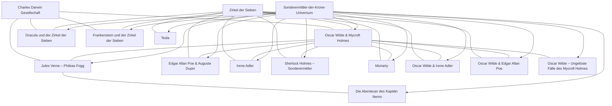

# Quellenlage & Kanonkarte

> Meta-Auswertung der Deep-Research-Recherche ([raw/deep-research-report.md](../../raw/deep-research-report.md)): Welche Quelle ist wofür belastbar, plus eine kondensierte Kanon-Beziehungskarte des Universums.

## Quellen-Eignung (welche Quelle wofür)

| Quelle | Stark für | Schwach / Lücken |
|---|---|---|
| **sonderermittler-der-krone.de** (Fanseite, Betreiber Tim Gerundt) | Reihenstruktur, Kanonzuordnung, Episodenreihenfolge, Episoden-/Cover-URLs, Kurzinhalt, Figurenliste | Vollständige Credits, Labels, exakte Handelsdaten, Katalognummern; ältere Folgen oft nur Jahr + Laufzeit; **redaktionelle Fehler** (siehe Tesla 1) |
| **HolyShop / Holysoft** | Maritim-Handelsdaten: Produkttyp, Label, Genre, Altersempfehlung, Format, oft exakte Erstveröffentlichung | „Mitwirkende" nicht immer offen ausgerollt; uneinheitlich indexierbar |
| **Kassettenkiste, Thalia, Audible, Apple Music, Storytel** | Blitz-Linien: exakte Erscheinungsdaten, Laufzeiten, EAN/ISBN, Sprecher, Plattformverfügbarkeit, teils Tracklisten | Tracklisten/Kapitelzeiten nur als Plattformdaten, nicht einheitlich über alle Folgen |
| **Black-Stone-/Zauberspiegel-Chronologie** | Serienübergreifende Kontinuität: Erstauftritte, Crossover-Ereignisse, In-Universe-Einordnung | Keine Primärquelle; nachrangig für reine Plot- oder Handelsdaten |

**Kernaufteilung:** Kanon & Ordnung → Fanseite; Verkaufs-/Handelsmetadaten → Händler; Kontinuität & Figurenwanderung → Chronologie.

## Korpus-Stand laut Report

- **305 offiziell gelistete Episoden** in **15 Serienlinien** (Kernreihen, Charakter-Spin-offs, Antagonistenreihen, zwei „Aus den Archiven"-Re-Brandings, Blitz-Mini-/Neureihen 2024–2026).
- Korpus ist **kanonisch indexiert, aber publizistisch in Bewegung**: Händler weisen 2026 bereits weiterlaufende/geplante Titel aus (u. a. Irene Adler, Moriarty, Poe & Dupin, Phileas Fogg, Frankenstein, Sherlock, OWMH), die auf der Fanseite noch nicht voll gespiegelt sind.
- Der vorliegende Vault deckt diesen 305-Folgen-Korpus inhaltlich bereits ab (Stand siehe [[log|log.md]]).

## Bekannte Datenfehler der Primärquelle

- **Tesla 1:** Fanseite labelt fälschlich „Im Spannungsfeld"; korrekt **„Die Kraft des Lichts"** (Cover `cover-m-tesla-01.jpg`, Thalia EAN 9783689842109, Kassettenkiste). „Im Spannungsfeld" ist der echte Titel von [[wiki/folgen/tesla-04-im-spannungsfeld|Tesla 4]]. Im Vault korrigiert → [[wiki/folgen/tesla-01-die-kraft-des-lichts|Tesla 1: Die Kraft des Lichts]]. Die offizielle URL behält den falschen Slug `folge01-im-spannungsfeld`.
- **Phileas Fogg 17 „Wie alles begann":** Fanseite wirkt fehlerhaft, dupliziert offenbar Folge 16 (bereits im Vault notiert).
- **Oscar Wilde & Irene Adler 3 „Ein Sommernachtsalbtraum":** Fanseite dupliziert offenbar Folge 2 (bereits im Vault notiert).

## Kanon-Beziehungskarte

> Stellt **Beziehungen** dar, nicht Besitzverhältnisse. Quelle: Deep-Research-Report, basierend auf Fanseite + Chronologie.

Verbindende Cluster sind weniger Gastauftritte als **wiederkehrende Verschwörungs- und Forschungsstrukturen**: der [[wiki/konzepte/zirkel-der-sieben|Zirkel der Sieben]] und die [[wiki/konzepte/charles-darwin-gesellschaft|Charles Darwin Gesellschaft]].

## Offene Punkte (nicht ingestiert)

Der Report enthält darüber hinaus **Handels-/Katalogmetadaten** (EAN/ISBN, Laufzeiten, Retailer-Links, Formate) — bislang nur für zwei Beispielepisoden voll ausgearbeitet (Tesla 1, Irene Adler 1). Eine flächige Aufnahme dieser Daten würde eine Schema-Erweiterung erfordern und ist bewusst **nicht** Teil dieses Ingests (Entscheidung Christian, 2026-05-27).

## Quellen

- [raw/deep-research-report.md](../../raw/deep-research-report.md)
