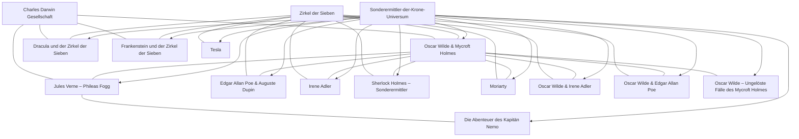

# Quellenlage & Kanonkarte

> Meta-Auswertung der Deep-Research-Recherche ([raw/deep-research-report.md](../../raw/deep-research-report.md)): Welche Quelle ist wofür belastbar, plus eine kondensierte Kanon-Beziehungskarte des Universums.

## Quellen-Eignung (welche Quelle wofür)

| Quelle | Stark für | Schwach / Lücken |
|---|---|---|
| **sonderermittler-der-krone.de** (Fanseite, Betreiber Tim Gerundt) | Reihenstruktur, Kanonzuordnung, Episodenreihenfolge, Episoden-/Cover-URLs, Kurzinhalt, Figurenliste | Vollständige Credits, Labels, exakte Handelsdaten, Katalognummern; ältere Folgen oft nur Jahr + Laufzeit; **redaktionelle Fehler** (siehe Tesla 1) |
| **HolyShop / Holysoft** | Maritim-Handelsdaten: Produkttyp, Label, Genre, Altersempfehlung, Format, oft exakte Erstveröffentlichung | „Mitwirkende" nicht immer offen ausgerollt; uneinheitlich indexierbar |
| **Kassettenkiste, Thalia, Audible, Apple Music, Storytel** | Blitz-Linien: exakte Erscheinungsdaten, Laufzeiten, EAN/ISBN, Sprecher, Plattformverfügbarkeit, teils Tracklisten | Tracklisten/Kapitelzeiten nur als Plattformdaten, nicht einheitlich über alle Folgen |
| **Black-Stone-/Zauberspiegel-Chronologie** | Serienübergreifende Kontinuität: Erstauftritte, Crossover-Ereignisse, In-Universe-Einordnung | Keine Primärquelle; nachrangig für reine Plot- oder Handelsdaten |

**Kernaufteilung:** Kanon & Ordnung → Fanseite; Verkaufs-/Handelsmetadaten → Händler; Kontinuität & Figurenwanderung → Chronologie.

## Neu bewertete Quellen (2026-09-06)

Ergebnis der Quellen-Scout-Recherche vom 06.09.2026. Alle drei sind **maschinenlesbare Schnittstellen ohne Zugangsschlüssel** und damit wiederholbar abrufbar — anders als die bisher genutzten HTML-Quellen.

| Quelle | Stark für | Schwach / Lücken |
|---|---|---|
| **Apple Music / iTunes Search API** (`itunes.apple.com/search`, Storefront DE) → [Rohdaten](../../raw/maritim/2026-09-06_apple-music-itunes-api_erscheinungsdaten.md) | **Exakte Erscheinungsdaten** für praktisch jede Folge der Hauptreihen (Fogg 1–52, OWMH 1–60, Poe & Dupin 1–36, Irene Adler 1–36, Dracula 1–16, Frankenstein 1–28, Sherlock 1–24, SHC 1–97); **Laufzeit** als Summe der Track-Zeiten (gegen 220 vorhandene `spielzeit_min`-Werte geprüft: 219 Treffer innerhalb ±2 min); Track-/Kapitelzahl; **kanonische Titelschreibweise inklusive Umlauten** | Keine Sprecher, keine EAN/ISBN. **Wichtigste Einschränkung:** Das gelieferte `releaseDate` ist das **digitale** Veröffentlichungsdatum und **nicht** durchgängig identisch mit dem Handelstermin, den der Vault bisher aus Fanseite und HolyShop bezogen hat. Gegenprobe an 135 Folgen, deren exaktes Datum bereits belegt war: **101 identisch (75 %), 34 abweichend**, Spanne −77 bis +77 Tage. Verteilung ungleich — `irene-adler` 32/32, `sherlock-holmes` 18/20, aber `oscar-wilde-und-mycroft-holmes` nur 28/55. Reihen ohne vollständigen Streaming-Katalog: **Moriarty (0 Folgen), Tesla (nur Folge 1), Kapitän Nemo (4)**. **Verwechslungsgefahr:** Parallellinien mit eigener Zählung (`Aus den Archiven`, `Die alten Fälle (Reloaded)`), englische Ausgaben, Sammelboxen und die Roman-Lesereihe `In 80 Tagen um die Welt` müssen vor dem Parsen ausgefiltert werden |
| **Deezer API** (`api.deezer.com`) → [Rohdaten](../../raw/maritim/2026-09-06_deezer-api_erscheinungsdaten-und-upc.md) | Unabhängige **Zweitbestätigung** der Apple-Daten (106 von 113 neu gesetzten Daten doppelt belegt); **UPC/EAN** je Album | Feld `duration` ist **unbrauchbar** (Dracula 1: 2263 s = 37,7 min statt real ~70 min). Volltextsuche mischt Nachbarreihen ein, Filter über den Interpretennamen ist Pflicht. Keine Sprecher, keine Autor:innen |
| **DNB SRU** (Deutsche Nationalbibliothek, `services.dnb.de/sru/dnb`) | **ISBN/EAN** der CD-Ausgaben, Verlagsfirma (`Timm + Wilken oHG, Schenefeld` hinter dem Label Maritim), Erscheinungsjahr, Preisbindung; weist auch **geplante Titel** vor Erscheinen nach | Nur Jahresangabe, kein Tagesdatum. `dc:creator` ist die Firma, nicht die Autor:in — für Autorschaft unbrauchbar. Keine Sprecher. Titelschreibweise fehlerhaft (Beispiel: „Gegen jeden Wiederstand" statt „Widerstand") |
| **Hörspieltalk-Forum** (Ankündigungsthreads, geben die Verlagsvorschau wieder) | **Titel, Klappentext und Besetzung** kommender Folgen — oft Monate vor allen anderen Quellen und bislang ohne Gegenbeleg falsch | **Datumsangaben sind unbrauchbar.** Für die Herbst-2026-Staffel lagen sie durchgängig **zu früh**: SH 24 −70 Tage, FRANK 28 −49, IADK 35 −14, OWMH 60 −7 (Gegenprobe Apple Music + Deezer, 06.09.2026). Ursache ist vermutlich die Wiedergabe früher Vorschautermine, die der Verlag später verschiebt. **Regel: Titel und Inhalt von dort übernehmen, Termine niemals ohne Plattformbeleg.** Zusätzlich uneinheitlich bei der Verlagszuordnung — führt die WMU-Reihe unter „Maritim" statt „Blitz Verlag" |

**Merksatz für den Datentyp:** Streaming-APIs sind die beste Quelle für **Datum und Laufzeit**, Bibliotheks- und Händlerdaten für **ISBN/EAN und Verlag**, und weiterhin ausschließlich die Händler-Detailseiten (HolyShop, Audiolibrix, Nextory) für **Autor:in**. Für **Sprecher:innen** existiert bislang **keine** flächendeckende maschinenlesbare Quelle.

### Neu gefundene Quellen-Fallstricke

- **`autor` ist Einzelquelle und bleibt es — entschieden am 06.09.2026:** Die 221 am 06.09.2026 nachgetragenen Autorenangaben stammen ausschließlich aus der Hörbuchsparte der iTunes Search API; die Fanseite nennt keine Autor:innen, eine zweite flächige Quelle existiert nicht. Damit unterschreitet das Feld die sonst geltende Zwei-Quellen-Regel. **Entscheidung (Christian): Werte bleiben stehen, das Feld ist für die Vault-Ziele nachrangig.** Keine weitere Recherche, aber auch keine Belastung von Aussagen durch `autor`. Wer das Feld auswertet, behandelt es als Einzelbeleg.

- **Nummernkollision durch Parallellinien:** Die iTunes/Deezer-Suche liefert für Poe & Dupin die Reihe `Aus den Archiven` mit eigener Zählung 1–12 mit. Ungefiltert überschreibt „Aus den Archiven, Folge 12: Die Klinik-Morde" (20.11.2020) die echte Folge 12 „In den Katakomben lauert der Tod" (29.01.2021). Dasselbe Muster bei `Sherlock Holmes – Die alten Fälle (Reloaded)` und bei Fogg durch `In 80 Tagen um die Welt`.
- **Laufzeit-Widerspruch DNAPF 36 „Der letzte Tag auf Erden":** Vault 58 min, Apple-Music-Trackssumme 67,7 min. Einziger Ausreißer unter 220 Vergleichswerten — Klärung offen.
- **Zwei Datumsbegriffe — entschieden am 06.09.2026:** Die an diesem Tag nachgetragenen 113 Erscheinungsdaten sind **digitale Veröffentlichungsdaten** aus Apple Music (106 davon zusätzlich durch Deezer bestätigt). Für Folgen, deren Handelstermin bereits belegt war, weichen diese in rund einem Viertel der Fälle ab. Das Feld `erschienen` mischt damit zwei Ereignisarten. **Entscheidung (Christian): bleibt so.** Kein neues Feld, keine Rücknahme. Begründung: `erschienen` dient im Vault nicht der Handelsdokumentation, sondern als Indiz für die **Timeline und für Handlungsverläufe zwischen Serien**. Dafür reicht die Genauigkeit — siehe die Granularitätsregel unten. Jede betroffene Folgenseite nennt die Quelle weiterhin im Eckdaten-Abschnitt; überschrieben wurde kein bereits tagesgenau belegtes Datum (Gegenprobe gegen den Stand vor dem Lauf: 114 Einträge neu datiert, davon 73 vorher jahresgenau und 41 ohne Datum, **0 Regressionen**).

> [!important] Granularitätsregel für `erschienen`
> **Belastbar ist die Zuordnung zum Release-Block, nicht die tagesgenaue Reihenfolge zwischen Serien.**
>
> Maritim liefert mehrere Serien im selben Schwung aus. Von den 141 tagesgenau neu datierten Folgen liegen **118 innerhalb einer Woche** neben einer Folge aus einer anderen Serie, und die Abstände häufen sich exakt auf **0 und 7 Tage** — das ist der Veröffentlichungstakt, keine Streuung. Beispiele: DNAPF 19 und OWMH 20 beide am 29.03.2019, DNAPF 20 und OWMH 21 beide am 31.05.2019, EAPAD 6 und OWMH 22 beide am 26.07.2019.
>
> Daraus folgt:
> - **Zulässig:** „Diese Folgen gehören zum selben Release-Block" — trägt die Aussage, dass zwei Serien einen Handlungsstrang parallel führen.
> - **Unzulässig:** „Folge A erschien vor Folge B", wenn der Abstand unter etwa einer Woche liegt. Dort entscheidet bei den neu datierten Folgen der Distributionszeitpunkt, nicht der Handelstermin; ein Fehler von wenigen Tagen kippt das Paar.
>
> Die Timeline-App sortiert bei gleichem Datum deterministisch nach `serie` und `nummer` (`compareFolgen` in `app/app.js`) — die Anzeige ist damit stabil, stellt aber ausdrücklich **keine** belegte Reihenfolge dar.

## Korpus-Stand laut Report

- **305 offiziell gelistete Episoden** in **15 Serienlinien** (Kernreihen, Charakter-Spin-offs, Antagonistenreihen, zwei „Aus den Archiven"-Re-Brandings, Blitz-Mini-/Neureihen 2024–2026).
- Korpus ist **kanonisch indexiert, aber publizistisch in Bewegung**: Händler weisen 2026 bereits weiterlaufende/geplante Titel aus (u. a. Irene Adler, Moriarty, Poe & Dupin, Phileas Fogg, Frankenstein, Sherlock, OWMH), die auf der Fanseite noch nicht voll gespiegelt sind.
- Der vorliegende Vault deckt diesen 305-Folgen-Korpus inhaltlich bereits ab (Stand siehe [[log|log.md]]).

## Bekannte Datenfehler der Primärquelle

- **Tesla 1:** Fanseite labelt fälschlich „Im Spannungsfeld"; korrekt **„Die Kraft des Lichts"** (Cover `cover-m-tesla-01.jpg`, Thalia EAN 9783689842109, Kassettenkiste). „Im Spannungsfeld" ist der echte Titel von [[wiki/folgen/tesla-04-im-spannungsfeld|Tesla 4]]. Im Vault korrigiert → [[wiki/folgen/tesla-01-die-kraft-des-lichts|Tesla 1: Die Kraft des Lichts]]. Die offizielle URL behält den falschen Slug `folge01-im-spannungsfeld`.
- **Phileas Fogg 17 „Wie alles begann":** Fanseite wirkt fehlerhaft, dupliziert offenbar Folge 16 (bereits im Vault notiert).
- **Oscar Wilde & Irene Adler 3 „Ein Sommernachtsalbtraum":** Fanseite dupliziert offenbar Folge 2 (bereits im Vault notiert).

## Kanon-Beziehungskarte

> Stellt **Beziehungen** dar, nicht Besitzverhältnisse. Quelle: Deep-Research-Report, basierend auf Fanseite + Chronologie.

```mermaid
graph TD
    U["Sonderermittler-der-Krone-Universum"]
    OWMH["Oscar Wilde & Mycroft Holmes"]
    DNAPF["Jules Verne – Phileas Fogg"]
    EAPAD["Edgar Allan Poe & Auguste Dupin"]
    IASK["Irene Adler"]
    SHSK["Sherlock Holmes – Sonderermittler"]
    MZGV["Moriarty"]
    DUZS["Dracula und der Zirkel der Sieben"]
    FUZS["Frankenstein und der Zirkel der Sieben"]
    TSL["Tesla"]
    OWIA["Oscar Wilde & Irene Adler"]
    OWEP["Oscar Wilde & Edgar Allan Poe"]
    OWW["Oscar Wilde – Ungelöste Fälle des Mycroft Holmes"]
    NEMO["Die Abenteuer des Kapitän Nemo"]
    Z7["Zirkel der Sieben"]
    CDG["Charles Darwin Gesellschaft"]

    U --> OWMH
    U --> DNAPF
    U --> EAPAD
    U --> IASK
    U --> SHSK
    U --> MZGV
    U --> DUZS
    U --> FUZS
    U --> TSL
    U --> OWIA
    U --> OWEP
    U --> OWW
    U --> NEMO

    OWMH --- IASK
    OWMH --- SHSK
    OWMH --- EAPAD
    OWMH --- DNAPF
    OWMH --- MZGV
    OWMH --- OWIA
    OWMH --- OWEP
    OWMH --- OWW
    DNAPF --- NEMO

    Z7 --- OWMH
    Z7 --- IASK
    Z7 --- SHSK
    Z7 --- EAPAD
    Z7 --- MZGV
    Z7 --- DUZS
    Z7 --- FUZS
    Z7 --- TSL
    Z7 --- OWIA
    Z7 --- OWEP

    CDG --- OWMH
    CDG --- DNAPF
    CDG --- DUZS
    CDG --- FUZS
```

Verbindende Cluster sind weniger Gastauftritte als **wiederkehrende Verschwörungs- und Forschungsstrukturen**: der [[wiki/konzepte/zirkel-der-sieben|Zirkel der Sieben]] und die [[wiki/konzepte/charles-darwin-gesellschaft|Charles Darwin Gesellschaft]].

## Offene Punkte (nicht ingestiert)

Der Report enthält darüber hinaus **Handels-/Katalogmetadaten** (EAN/ISBN, Laufzeiten, Retailer-Links, Formate) — bislang nur für zwei Beispielepisoden voll ausgearbeitet (Tesla 1, Irene Adler 1). Eine flächige Aufnahme dieser Daten würde eine Schema-Erweiterung erfordern und ist bewusst **nicht** Teil dieses Ingests (Entscheidung Christian, 2026-05-27).

**Nachtrag 2026-09-06:** Die **UPC/EAN** liegen seitdem für einen großen Teil des Korpus maschinell abgerufen vor (siehe [Deezer-Rohdaten](../../raw/maritim/2026-09-06_deezer-api_erscheinungsdaten-und-upc.md)), zusätzlich die ISBN der CD-Ausgaben über DNB SRU. Sie sind **weiterhin nicht** ins Schema aufgenommen — die Entscheidung von 2026-05-27 gilt unverändert; die Daten liegen jetzt lediglich abrufbereit unter `raw/`.

## Quellen

- [raw/deep-research-report.md](../../raw/deep-research-report.md)
